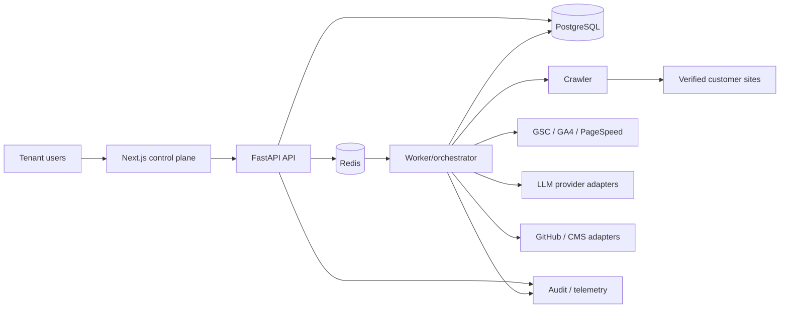

# Architecture

## 1. Principles

1. Control plane and execution plane are separated.
2. PostgreSQL is the source of truth; Redis is coordination, never durable truth.
3. Raw observations are immutable; derived findings and scores are versioned.
4. LLMs propose structured analysis but cannot authorize, deploy, or verify their own work.
5. Every external side effect is idempotent, policy-checked, auditable, and reversible where the provider permits.

## 2. System context

## 3. Deployable components

- **Web:** server-rendered Next.js UI. It never holds provider refresh tokens or makes privileged connector calls from the browser.
- **API:** authentication, tenant/resource authorization, CRUD, approval commands, webhook intake, signed upload URLs, and read models.
- **Worker:** durable job execution, connector syncs, scoring, agent orchestration, proposal validation, deployment, verification, and measurement scheduling.
- **Crawler:** isolated browser/HTTP process with egress policy, DNS/IP validation, host budgets, response size limits, and no control-plane credentials.
- **PostgreSQL:** transactional state, outbox, immutable audit chain, observations, policies, proposals, deployments, and measurement series.
- **Redis:** queues, short-lived locks, rate-limit counters, and cache. Jobs remain reconstructible from PostgreSQL.
- **Object storage (production):** compressed crawl artifacts and approved snapshots with tenant-prefixed keys and lifecycle rules.

## 4. Bounded contexts

- Identity & tenancy
- Site inventory & verification
- Connectors & consent
- DNS-provider adapter registry: universal manual TXT verification plus optional provider-specific
  adapters behind the same exact-zone, two-consent, audit, and secret-store contract.
- Crawl & observations
- Findings, scoring & opportunities
- Agent runs & evidence
- Proposals, policy & approvals
- Deployment & rollback
- Measurement & reporting
- Audit, usage & billing

Cross-context writes go through application commands and an outbox. Consumers are idempotent and record the handled event ID.

## 5. Primary data flow

1. API creates a `crawl_job` and outbox event in one transaction.
2. Dispatcher publishes the job ID to Redis.
3. Crawler resolves only an already-verified site host, checks DNS against forbidden ranges before each navigation, and records observations.
4. Worker normalizes observations and runs deterministic rules first.
5. Agent orchestrator selects only the minimum approved evidence, redacts secrets/PII, and calls an LLM adapter with a schema-bound request.
6. Output is schema-validated, citation-checked against evidence IDs, and stored as an untrusted agent result.
7. Scoring creates versioned findings/opportunities. Proposal generation produces a diff but no side effect.
8. Policy engine resolves mode, risk, required approvers, validations, freeze windows, and budgets.
9. Deployment adapter performs a compare-and-set against the current source revision, creates the PR/staged revision, and stores receipt.
10. Verifier re-crawls the target and measurement scheduler creates follow-up windows.

Crawler execution is bounded by page count, depth, a discovery budget of ten times the page limit,
20 sitemap candidates, 5 MB HTTP/rendered bodies, 100 browser requests per rendered page, 5,000
persisted links per page, redirect/time limits, and per-host pacing. Truncation and error counts are
persisted in `crawl_job.result_summary`; per-page link truncation is explicit evidence rather than a
silent omission.

## 6. LLM abstraction

`LLMProvider` exposes `generate_structured(request, response_schema, policy_context)`. Adapters normalize model identity, latency, token/cost data, safety outcome, request hash, and response hash. Prompts reference evidence IDs rather than embedding unrestricted datasets where practical.

Provider routing considers tenant policy, data region, task capability, cost ceiling, and health. Initial local configuration may use OpenAI; the domain layer depends only on the interface. Provider/model changes create a new analysis version and never silently rewrite prior results.

## 7. Agent orchestration

Agents are workflows with:

- declared input schema and evidence types;
- allowed tools (read-only by default);
- output schema and confidence rubric;
- maximum token, cost, latency, and retry budgets;
- deterministic pre/post validators;
- versioned prompt and model metadata.

Agent results are advisory. A separate policy engine and deployment service own effects. Prompt injection in crawled content is treated as hostile data and never changes tool permissions or system policy.

## 8. Multi-tenancy

Shared-database/shared-schema for MVP, with mandatory `tenant_id`, composite indexes, repository enforcement, and transaction-scoped database tenant context. PostgreSQL RLS is enabled before design-partner data. Enterprise dedicated database/storage can be introduced behind the same repository interfaces.

Cache keys, queue payloads, object keys, metrics, logs, rate limits, and idempotency scopes include tenant identity. Connector credentials are envelope-encrypted per tenant and referenced by opaque secret IDs.

## 9. Reliability

- Transactional outbox avoids database/queue split-brain.
- Jobs use leases with heartbeats and bounded retries; dead letters retain safe metadata.
- PageSpeed runs use a dedicated Redis consumer group, but durable run/lease state and immutable
  normalized observations remain in PostgreSQL; provider response bodies are discarded.
- External writes use provider idempotency when available and internal operation keys always.
- Circuit breakers isolate failing providers; per-tenant budgets prevent noisy neighbors.
- Backups: PITR for PostgreSQL, versioned object storage, quarterly restore test.
- Global and per-tenant deployment kill switches are read from durable configuration and cached briefly.

## 10. Environments and delivery

- Local: Docker Compose for PostgreSQL/Redis; apps run either on host or containers.
- Preview: isolated database schema and mock/sandbox connectors; never production credentials.
- Staging: production topology with synthetic sites and provider sandboxes.
- Production: private networking, managed database/cache, secret manager, WAF, restricted egress, centralized telemetry.

Infrastructure is provisioned as code. Schema migrations use expand/migrate/contract. Releases use canaries for worker and deployment changes; rollback never assumes a database downgrade.

## 11. Key ADRs to create during Phase 0

- ADR-001 identity provider and tenant context propagation.
- ADR-002 queue/outbox technology and delivery semantics.
- ADR-003 crawler sandbox and egress enforcement.
- ADR-004 connector secret management and token rotation.
- ADR-005 first CMS connector and staging semantics.
- ADR-006 scoring calibration and version governance.
- ADR-007 LLM provider/data residency routing.
