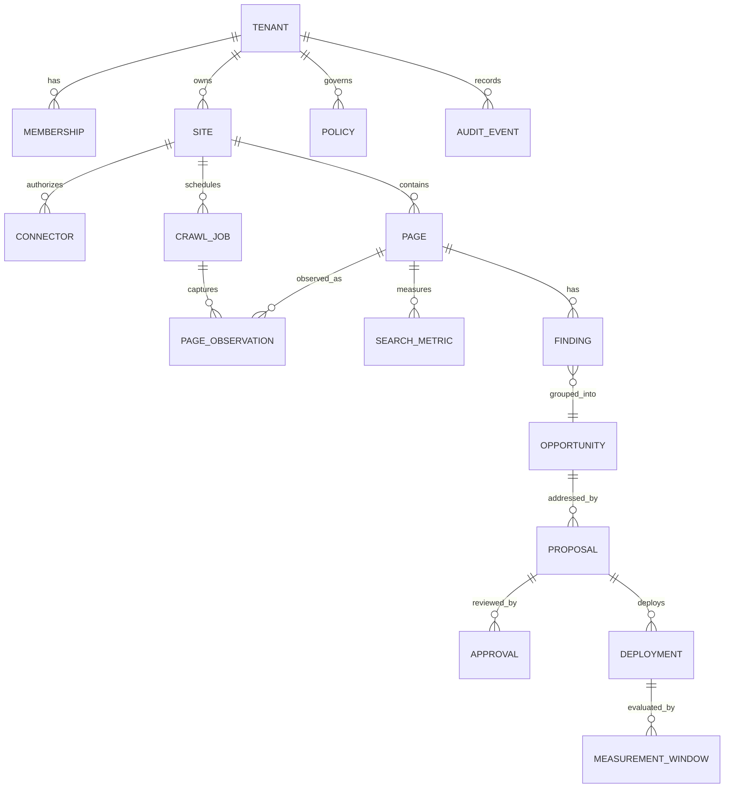

# Data Model

## Conventions

- PostgreSQL 17+; UUID primary keys; `timestamptz` in UTC; `jsonb` only for versioned provider payloads or flexible evidence.
- Tenant-owned tables include non-null `tenant_id` and tenant-leading indexes.
- Mutable entities include `version` for optimistic concurrency and `created_at`/`updated_at`.
- Soft deletion is explicit (`archived_at`) only where recovery/audit needs it; observations and audit events are append-only.
- URLs are stored as original, normalized, and a stable SHA-256 fingerprint. Never use a URL alone as authorization.

## Entity map

## Core tables

### Identity and tenancy

- `tenant(id, slug, name, status, plan, data_region, retention_days, created_at)`
- `user_account(id, identity_subject, email_normalized, display_name, status, created_at)`
- `membership(id, tenant_id, user_id, role, status, invited_by, created_at, unique(tenant_id,user_id))`
- `service_account(id, tenant_id, name, scopes[], expires_at, revoked_at)`

Roles are coarse. Authorization policies evaluate action, resource, site environment, connector, proposal risk, and separation-of-duties constraints.

### Sites and connectors

- `site(id, tenant_id, name, canonical_origin, normalized_host, mode, status, verified_at, verification_method, policy_id, crawl_rules_json, version)`
- `site_environment(id, tenant_id, site_id, kind, origin, deploy_enabled)`
- `connector(id, tenant_id, site_id, type, status, external_account_ref, secret_ref, granted_scopes[], consented_by, consented_at, last_sync_at, token_expires_at, version)`
- `connector_oauth_state(id, tenant_id, site_id, connector_id, state_hash, requested_scopes[], expires_at, consumed_at, created_by)`
- `connector_secret(id, tenant_id, connector_id, provider, ciphertext, nonce, aad_hash, key_version, created_at, revoked_at)`
- `connector_sync(id, tenant_id, connector_id, kind, idempotency_key, cursor_json, range_start, range_end, status, counts_json, lease_until, started_at, finished_at, error_code)`

OAuth access/refresh tokens are never stored in these rows; `secret_ref` points to an envelope-encrypted secret store entry.
Migration `0009_connector_secret_envelope.sql` adds the local/test AES-256-GCM envelope and the
requested GSC property binding. Its ciphertext is authenticated with tenant, connector, provider,
and key-version context. Staging/production configuration rejects this database backend and requires
a managed secret adapter.

`dns_provider` is a provider-neutral connector type with `provider_key` (for example `cloudflare`).
It binds an Owner/Admin-consented credential to one exact provider zone ID after the adapter returns
the zone name and it matches `site.normalized_host`. The credential is stored only at `secret_ref`;
audit events retain no credential or TXT value. DNS record creation is a second explicit consent event
bound to an unexpired `site_verification_challenge`. Manual TXT verification remains available for
every DNS host and does not depend on a connector.

### Crawl and page inventory

- `crawl_job(id, tenant_id, site_id, kind, status, requested_by, config_snapshot_json, robots_snapshot_hash, lease_until, started_at, finished_at, error_code, result_summary)`
- `page(id, tenant_id, site_id, normalized_url, url_hash, canonical_page_id, first_seen_at, last_seen_at, lifecycle_status, unique(site_id,url_hash))`
- `page_observation(id, tenant_id, page_id, crawl_job_id, observed_at, http_status, final_url, canonical_url, robots_directives[], title, meta_description, h1_json, lang, content_hash, text_fingerprint, word_count, rendered, timing_json, structured_data_json, link_count_total, links_truncated, artifact_ref)`
- `link_edge(id, tenant_id, crawl_job_id, source_page_id, target_page_id, target_url_hash, rel_values[], anchor_text_redacted, is_internal, status)`
- `sitemap_observation(id, tenant_id, crawl_job_id, sitemap_url, url_hash, lastmod, status)`

Large DOM, screenshots, traces, and response bodies live in object storage with retention policy. Database rows retain safe hashes and references.

Implementation note: migration `0004_page_evidence_and_links.sql` persists canonical URLs, robots
directives, bounded JSON-LD, and internal link edges. Link targets are stored as normalized URLs plus
SHA-256 fingerprints; raw response bodies are not retained in PostgreSQL.

Migrations `0006_crawl_result_summary.sql` and `0007_link_evidence_bounds.sql` retain crawl-boundary
outcomes and make per-page link truncation observable. These are evidence-quality signals; a partial
crawl cannot be presented as complete coverage.

### Search and performance evidence

- `search_metric(id, tenant_id, site_id, page_id, metric_date, query_hash, page_url, page_url_hash, country, device, search_type, clicks, impressions, ctr, position, source_sync_id)`
- `analytics_metric(id, tenant_id, site_id, page_id, date, sessions, engaged_sessions, conversions, revenue_micros, source_sync_id)`
- `performance_observation(id, tenant_id, page_id, observed_at, strategy, source, lighthouse_version, performance_score, lcp_ms, inp_ms, cls_micros, ttfb_ms, raw_ref)`

Queries can contain personal/sensitive data. The MVP stores only an HMAC-SHA-256 keyed hash using a
dedicated environment key; no raw or decryptable query column exists. A later query-display feature
requires explicit tenant policy, encrypted storage, retention controls, and security review.

### Analysis and opportunities

- `analysis_run(id, tenant_id, site_id, agent_type, agent_version, model_provider, model_id, prompt_version, evidence_cutoff, request_hash, response_hash, token_usage_json, cost_micros, status, validation_json, created_at)`
- `finding(id, tenant_id, site_id, page_id, analysis_run_id, rule_key, severity, category, evidence_refs[], summary, details_json, confidence, status, fingerprint, first_seen_at, last_seen_at)`
- `scoring_version(id, code_version, factor_config_json, approved_by, active_from, retired_at)`
- `page_score(id, tenant_id, page_id, scoring_version_id, calculated_at, score, factors_json, evidence_cutoff, unique(page_id,scoring_version_id,evidence_cutoff))`
- `opportunity(id, tenant_id, site_id, type, title, status, impact, confidence, urgency, effort, risk, score, scoring_version_id, evidence_refs[], fingerprint, suppressed_reason, created_at)`
- `opportunity_finding(tenant_id, opportunity_id, finding_id)`
- `calibration_run(id, tenant_id, site_id, status, strategy, target_size, scoring_version_id, idempotency_key, request_hash, created_by, created_at, completed_at)`
- `calibration_item(id, tenant_id, calibration_run_id, opportunity_id, page_id, ordinal, rule_key, evidence_snapshot, created_at)`
- `calibration_review(id, tenant_id, calibration_item_id, reviewer_id, accuracy_label, actionability, severity_fit, notes, request_hash, idempotency_key, created_at)`

Implementation note: migration `0005_scoring_and_opportunities.sql` adds the provisional
`technical-v1` scoring version, crawl-linked analysis runs, durable page scores, deduplicated
findings/opportunities, evidence references, ranking indexes, and RLS. Page observations become
unique per page/crawl so delivery retries update evidence instead of multiplying it.

Migration `0010_calibration_reviews.sql` adds one-open-run-per-site enforcement, frozen evidence
snapshots, append-only assessments, replay-safe request hashes, composite tenant foreign keys,
indexes, and RLS. Roll forward is preferred. Before production data exists, rollback requires
dropping the three calibration tables and then `opportunity_id_tenant_unique`; never perform that
rollback after reviews become customer decision records without retention and audit approval.

Migration `0011_one_active_crawl.sql` adds a partial unique index on `(tenant_id,site_id)` for
`queued` and `running` crawl jobs. It prevents concurrent requests from creating overlapping evidence
runs. Rollback is `DROP INDEX crawl_job_one_active_per_site_idx`, but removing it reopens duplicate
execution risk and therefore requires a replacement concurrency control.

### Proposals, approval, deployment

- `proposal(id, tenant_id, site_id, opportunity_id, revision, status, risk, title, rationale, evidence_refs[], change_manifest_json, before_hash, proposed_hash, policy_version, expires_at, created_by, version)`
- `validation_run(id, tenant_id, proposal_id, proposal_revision, suite_version, status, checks_json, started_at, finished_at)`
- `approval(id, tenant_id, proposal_id, proposal_revision, decision, actor_id, role_at_decision, reason, policy_version, decided_at)`
- `deployment(id, tenant_id, proposal_id, proposal_revision, environment_id, connector_id, idempotency_key, status, external_ref, source_revision, target_revision, receipt_json, deployed_by, deployed_at, verified_at, rollback_of_id, unique(tenant_id,idempotency_key))`
- `deployment_verification(id, tenant_id, deployment_id, status, checks_json, artifact_refs[], observed_at)`
- `measurement_window(id, tenant_id, deployment_id, metric_key, baseline_start, baseline_end, followup_start, followup_end, status, baseline_json, result_json, caveats_json)`

`change_manifest_json` is schema-versioned and includes exact targets, before/after values or patch, validations, rollback instructions, and prohibited-change scan results.

### Performance observations

- `performance_run(id, tenant_id, site_id, page_id, crawl_job_id, status, strategy, source, target_url, idempotency_key, request_hash, requested_by, attempts, lease_until, started_at, finished_at, error_code, created_at)`
- `performance_observation(id, tenant_id, performance_run_id, site_id, page_id, observed_at, strategy, source, lighthouse_version, performance_score, lcp_ms, inp_ms, cls, ttfb_ms)`

Migration `0012_pagespeed_observations.sql` adds one-active-run enforcement, tenant-composite run
references, metric bounds, retry/lease state, indexes, and RLS. The run freezes a URL selected from
the latest crawl; the immutable observation retains only bounded normalized metrics. The full
PageSpeed response is intentionally not stored. Roll forward is preferred. Before customer evidence
exists, rollback drops `performance_observation` then `performance_run`; after observations exist,
retention and audit approval are required before any removal.

### Governance and operations

- `policy(id, tenant_id, name, version, status, rules_json, approved_by, approved_at, effective_at)`
- `audit_event(id, tenant_id, occurred_at, actor_type, actor_id, action, resource_type, resource_id, trace_id, ip_prefix, user_agent_hash, before_hash, after_hash, metadata_json, previous_event_hash, event_hash)`
- `outbox_event(id, tenant_id, event_type, event_version, aggregate_type, aggregate_id, payload_json, occurred_at, published_at, attempts)`
- `idempotency_record(id, tenant_id, scope, key, request_hash, response_ref, status, expires_at)`

### Scheduled routines and reporting

- `routine(id, tenant_id, site_id, kind, cadence, schedule_hour_utc, schedule_minute_utc,
  schedule_isodow, schedule_dom, enabled, next_run_at, last_run_at, last_status,
  consecutive_failures, config_json, created_by, version)` — unique on `(tenant_id, site_id, kind)`.
  `schedule_dom` is capped at 28 so every month contains the slot.
- `routine_run(id, tenant_id, routine_id, site_id, kind, status, trigger, scheduled_for,
  started_at, finished_at, lease_until, attempts, skip_reason, error_code, summary_json)` — unique
  on `(routine_id, scheduled_for)`, which makes the scheduler idempotent across restarts and
  replicas.
- `report(id, tenant_id, site_id, routine_run_id, kind, period_start, period_end, generated_at,
  scoring_version_id, content_hash, payload_json)` — unique on
  `(tenant_id, site_id, kind, period_start, period_end)`; `content_hash` is the SHA-256 of the
  canonical payload, so an identical evidence set reproduces an identical report.
- `notification_channel(id, tenant_id, site_id, kind, name, enabled, destination_hint, ciphertext,
  nonce, aad_hash, key_version, created_by, revoked_at)` — the webhook URL lives only in the
  AES-256-GCM envelope; `destination_hint` is the only readable form.
- `notification_delivery(id, tenant_id, channel_id, report_id, status, attempts, lease_until,
  delivered_at, error_code)` — unique on `(channel_id, report_id)` so a report is delivered once
  per channel.

All five tables enable row-level security with the standard `app.tenant_id` policy.

### Keyword workspace

- `search_query(tenant_id, site_id, query_hash, ciphertext, nonce, aad_hash, key_version,
  term_length, token_count, is_question, first_seen_at, last_seen_at)` — the readable term is held
  once per `(site, query)` inside an AES-256-GCM envelope whose AAD binds tenant, site, and key
  version, so a row lifted into another site's context does not open. `search_metric` still stores
  only the keyed HMAC; `term_length`, `token_count`, and `is_question` are non-reversible shape
  signals safe to expose.
- `keyword_analysis_run(id, tenant_id, site_id, routine_run_id, algorithm_version, status,
  window_start, window_end, queries_considered, clusters_built, content_hash)` — unique on
  `(tenant_id, site_id, window_start, window_end, algorithm_version)`, so rerunning a window
  replaces it rather than accumulating.
- `keyword_cluster(id, tenant_id, site_id, analysis_run_id, label, cluster_key, intent,
  answer_engine_candidate, member_count, clicks, impressions, ctr, best_position, average_position,
  striking_distance_count, primary_page_id, competing_page_count, opportunity_score)` — carries no
  query term; the label is derived from the cluster's shared tokens.
- `keyword_cluster_member(tenant_id, cluster_id, site_id, query_hash, clicks, impressions, ctr,
  position, best_page_id)` — joins back to `search_query` for the sealed term.

All four tables enable row-level security with the standard `app.tenant_id` policy.

### Sitemap coverage

- `sitemap_source(id, tenant_id, site_id, crawl_job_id, sitemap_url, discovered_via, status,
  declared_url_count, in_scope_url_count, truncated, fetched_at)` — one row per sitemap a crawl
  considered. `discovered_via` is `well_known` or `robots_txt`; `status` records `fetched`,
  `unreachable`, `malformed`, or `out_of_scope`, so an off-host sitemap is recorded without ever
  being fetched.
- `sitemap_url(tenant_id, crawl_job_id, url_hash, site_id, sitemap_source_id, normalized_url)` —
  every in-scope URL a sitemap declared, whether or not the crawl reached it. This is what makes
  "declared but never crawled" answerable rather than inferred.

Coverage is always computed within a single `crawl_job_id`; comparing a sitemap from one crawl
against pages from another would mix a stale declaration with a fresh page set. A page counts as
indexable when the crawl saw a 200, no `noindex` directive, and a canonical that is absent or
self-referential. Both tables enable row-level security with the standard `app.tenant_id` policy.

### Content briefs

- `content_brief(id, tenant_id, site_id, keyword_cluster_id, analysis_run_id, routine_run_id, kind,
  status, target_page_id, cluster_label, intent, answer_engine_candidate, priority_score,
  sections_json, evidence_json, query_hashes, content_hash, dismissed_reason, dismissed_by,
  dismissed_at, version)` — unique on `(tenant_id, keyword_cluster_id)`, so regenerating updates a
  brief in place and bumps its version rather than accumulating duplicates. A check constraint ties
  `kind='refresh'` to a target page and `kind='new_page'` to none, and another ties `dismissed`
  status to a stored reason. `query_hashes` references members; no readable term is persisted here.
  Row-level security uses the standard `app.tenant_id` policy.

### Competitors and answer-engine readiness

- `competitor(id, tenant_id, site_id, normalized_host, label, status, created_by)` — unique on
  `(tenant_id, site_id, normalized_host)`.
- `competitor_page(id, tenant_id, competitor_id, site_id, normalized_url, url_hash,
  keyword_cluster_key, status, created_by)` — the complete set of URLs a scan may request. There is
  no discovery path that adds rows here.
- `competitor_scan(id, tenant_id, site_id, routine_run_id, status, started_at, finished_at,
  pages_requested, pages_observed, pages_blocked, pages_failed, error_code)`.
- `competitor_observation(id, tenant_id, competitor_scan_id, competitor_page_id, site_id, outcome,
  http_status, title, meta_description, h1_json, heading_count, word_count, internal_link_count,
  structured_data_types, content_hash)` — `outcome` records `observed`, `robots_disallowed`,
  `unreachable`, `not_html`, or `too_large`. Body text is never stored; `content_hash` shows that a
  page changed without retaining what it said.
- `ai_visibility_snapshot(id, tenant_id, site_id, routine_run_id, crawl_job_id, captured_on,
  readiness_score, factors_json, content_hash, citation_source)` — one per site per day.
  `citation_source` is constrained to `none`, so a later writer cannot imply an observed
  answer-engine citation the platform never measured.

All five tables enable row-level security with the standard `app.tenant_id` policy.

### Agent workspace

- `agent_session(id, tenant_id, site_id, title, status, message_count, created_by)`.
- `agent_task(id, tenant_id, session_id, site_id, skill_key, status, routine_run_id, result_json,
  error_code, requested_by, finished_at)` — one row per skill invocation, whether it answered from
  evidence or queued work.
- `agent_message(id, tenant_id, session_id, site_id, sequence, role, body, skill_key,
  agent_task_id, evidence_json)` — unique on `(session_id, sequence)`. A check constraint keeps
  `skill_key` and `agent_task_id` off user messages. `evidence_json` holds references to the stored
  records an answer was built from; an agent message with no evidence is a routing or refusal
  message, never an assertion.

The skill registry itself lives in code (`services/api/app/domain/skills.py`), versioned with the
service rather than stored as data, so the set of things the agent can do cannot be widened by a
database write. All three tables enable row-level security with the standard `app.tenant_id` policy.

## State machines

- Crawl: `queued -> running -> completed | partial | failed | cancelled`.
- Opportunity: `open -> shortlisted -> proposing -> proposed -> accepted | dismissed | expired`.
- Proposal: `draft -> validating -> ready_for_review -> approved | rejected | expired -> deploying -> deployed -> verified | failed | rolled_back`.
- Connector: `pending -> connected -> degraded | reauth_required | revoked`.

Invalid transitions return conflict errors and create security/audit signals when suspicious.

### Routine run lifecycle

`queued -> running -> completed | failed | skipped`

A run is `skipped` with a recorded reason when the site is unverified, frozen, the routine is
parked after repeated failures, a crawl is already active, or the kind is not implemented yet. A
skip is a first-class outcome, not a silent success.

### Content brief lifecycle

`queued -> in_progress -> done`, with `dismissed` reachable from `queued` or `in_progress` and
reopenable to `queued`. `done` reopens only to `in_progress`. A brief never enters the deployment
path: it is advice, and any change it motivates is authored as a proposal.

## Isolation and retention

- Foreign keys for tenant-owned relationships include tenant identity where practical to prevent accidental cross-tenant references.
- RLS policies compare `tenant_id` with a transaction-local trusted context; maintenance roles are separate and audited.
- Deletion creates a purge workflow: revoke connectors, delete secret refs, tombstone tenant, remove object prefixes, purge metrics/content by retention class, retain only legally required pseudonymous audit evidence.
